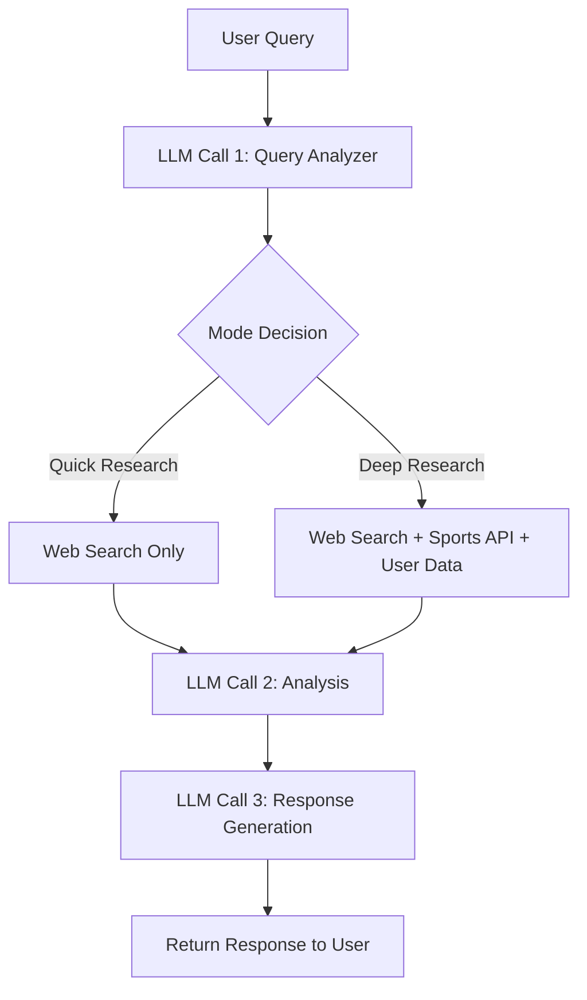

# Sports Betting Research Assistant

A sophisticated AI-powered research assistant for sports betting analysis, leveraging LLM-based prompt chaining and multiple data sources.

## System Architecture

### Research Chain Workflow

### Mode Selection Logic

The system automatically determines the appropriate research mode based on query complexity:

#### Quick Research Mode
- Simple queries (e.g., "What's the spread for Lakers game tonight?")
- Current basic information requests
- Single data point lookups
- Data Sources: Web Search

#### Deep Research Mode
- Complex queries requiring multiple data points
- Historical analysis requests
- Queries mentioning trends/stats/standings
- Multiple team/player comparisons
- Data Sources: Web Search + Sports API + User History

### Core Components

1. **Query Analysis (LLM Call 1)**
   - Intent detection
   - Entity extraction
   - Mode determination
   - Data requirement analysis

2. **Data Gathering**
   - Web search via Perplexity AI
   - Sports API integration
   - User history from database
   - Parallel data fetching

3. **Analysis (LLM Call 2)**
   - Data synthesis
   - Pattern recognition
   - Risk assessment
   - Confidence scoring

4. **Response Generation (LLM Call 3)**
   - Natural language formatting
   - Insight prioritization
   - Citation inclusion
   - Recommendation generation

## Technical Stack

- **Framework**: FastAPI
- **Database**: Supabase (PostgreSQL)
- **LLM Integration**: OpenAI GPT-4
- **External APIs**:
  - Perplexity AI (Web Search)
  - Sports API (Stats & Odds)
  - Supabase (User Data)
- **Observability**: Langfuse

## Key Features

- Dual-mode research capability (Quick/Deep)
- Async/parallel data gathering
- Structured data analysis
- Natural language responses
- User context integration
- Comprehensive error handling
- Request tracing and logging

## Development Guidelines

1. **Code Organization**
   - Clear separation of concerns
   - Modular service architecture
   - Type-safe interfaces
   - Comprehensive error handling

2. **Performance**
   - Async operations
   - Parallel data gathering
   - Response caching
   - Resource cleanup

3. **Reliability**
   - Graceful degradation
   - Fallback mechanisms
   - Comprehensive logging
   - Request tracing

4. **Security**
   - API key management
   - Rate limiting
   - Input validation
   - Error sanitization

## Getting Started

[Installation and setup instructions to be added]

## Contributing

[Contribution guidelines to be added]

## License

[License information to be added]

