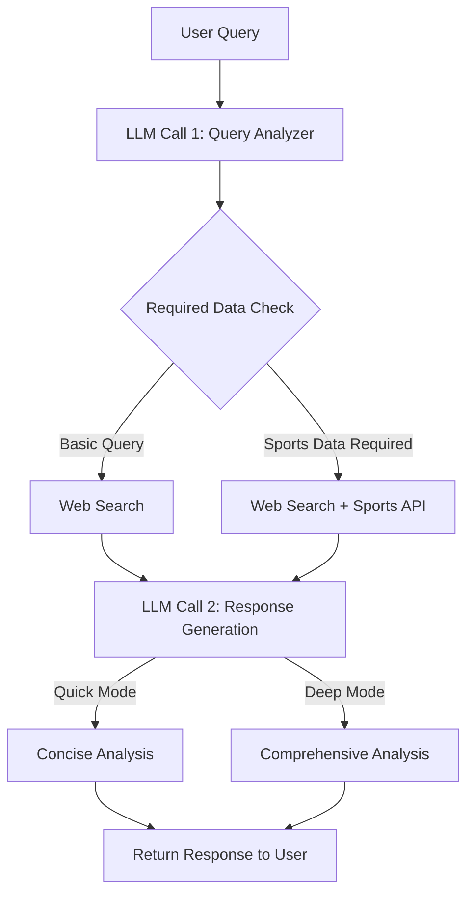

# Sports Betting Research Assistant

A sophisticated AI-powered research assistant for sports betting analysis, leveraging LLM-based prompt chaining and multiple data sources.

## System Architecture

### Research Chain Workflow

### Mode Selection & Data Gathering

The system determines what data to gather based on the query requirements, while the mode controls the depth of analysis:

#### Data Gathering Logic
- Web search data is always fetched first
- Sports API data is fetched when required, regardless of mode
- Data requirements are determined by query analysis
- Parallel data fetching for efficiency

#### Quick Research Mode
- Concise, focused analysis
- Direct answers to queries
- Key insights highlighted
- Minimal contextual information

#### Deep Research Mode
- Comprehensive analysis
- Multiple data points considered
- Historical context integration
- Detailed insights and correlations
- Risk assessment and trends

### Core Components

1. **Query Analysis (LLM Call 1)**
   - Intent detection
   - Entity extraction
   - Mode determination
   - Required data identification

2. **Data Gathering**
   - Web search via Perplexity AI
   - Sports API integration (when required)
   - Parallel data fetching
   - Data validation and transformation

3. **Response Generation (LLM Call 2)**
   - Mode-based analysis depth
   - Data synthesis
   - Natural language formatting
   - Confidence scoring

## Technical Stack

- **Framework**: FastAPI
- **Database**: Supabase (PostgreSQL)
- **LLM Integration**: OpenAI GPT-4
- **External APIs**:
  - Perplexity AI (Web Search)
  - Sports API (Stats & Odds)
  - Supabase (User Data)
- **Observability**: Langfuse

## Key Features

- Dual-mode research capability (Quick/Deep)
- Async/parallel data gathering
- Structured data analysis
- Natural language responses
- User context integration
- Comprehensive error handling
- Request tracing and logging

## Development Guidelines

1. **Code Organization**
   - Clear separation of concerns
   - Modular service architecture
   - Type-safe interfaces
   - Comprehensive error handling

2. **Performance**
   - Async operations
   - Parallel data gathering
   - Response caching
   - Resource cleanup

3. **Reliability**
   - Graceful degradation
   - Fallback mechanisms
   - Comprehensive logging
   - Request tracing

4. **Security**
   - API key management
   - Rate limiting
   - Input validation
   - Error sanitization

## Getting Started

[Installation and setup instructions to be added]

## Contributing

[Contribution guidelines to be added]

## License

[License information to be added]

