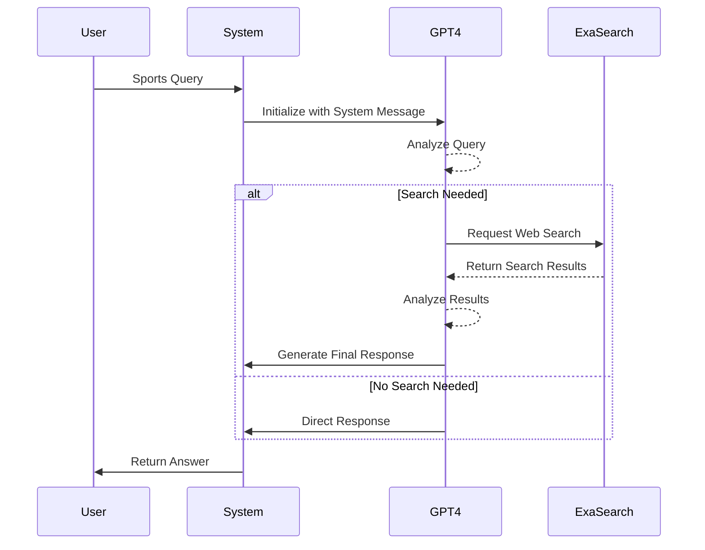

# Sports Research Assistant MVP

A simple sports research chatbot that uses OpenAI's GPT-4 and Exa's web search capabilities to provide up-to-date sports information.

## Overview

This MVP demonstrates a basic implementation of a sports research assistant that can:
- Process natural language queries about sports
- Perform real-time web searches for current information
- Provide accurate, sourced responses about games, scores, stats, and news

## Flow Diagram



## How It Works

1. **Query Input**
   - User submits a sports-related question
   - System initializes conversation with sports assistant context

2. **Query Analysis**
   - GPT-4 analyzes the query
   - Determines if web search is needed
   - Formulates search strategy if required

3. **Web Search (if needed)**
   - Executes targeted web search via Exa API
   - Retrieves relevant sports information
   - Limited to top 5 most relevant results

4. **Response Generation**
   - GPT-4 processes search results
   - Synthesizes information into coherent answer
   - Returns formatted response to user

## Quick Start

1. Install dependencies:
```bash
pip install openai exa-py python-dotenv
```

2. Set up environment variables in `.env`:
```
OPENAI_API_KEY=your_openai_key
EXA_API_KEY=your_exa_key
```

3. Run the assistant:
```bash
python exa_search.py "Who won the Lakers game last night?"
```

## Example Usage

```bash
# Basic query
python exa_search.py "What NBA games are scheduled for tonight?"

# Specific team query
python exa_search.py "What is the Warriors' current record?"

# Player stats query
python exa_search.py "How many points did Jokic score in his last game?"
```

## Technical Details

- **Model**: GPT-4
- **Search Engine**: Exa Search API
- **Results Limit**: 5 most relevant results per search
- **Error Handling**: Basic error catching and reporting

## Next Steps

Future enhancements could include:
- FastAPI endpoint for web integration
- Conversation history support
- Multiple search tools for different data sources
- Enhanced error handling and retry logic
- Response caching for common queries