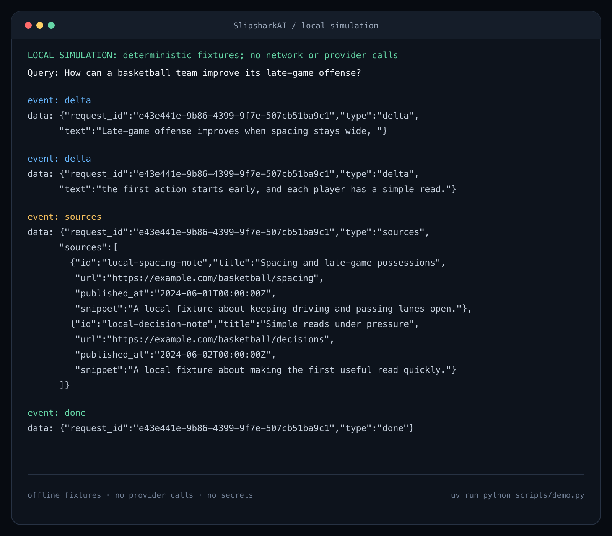
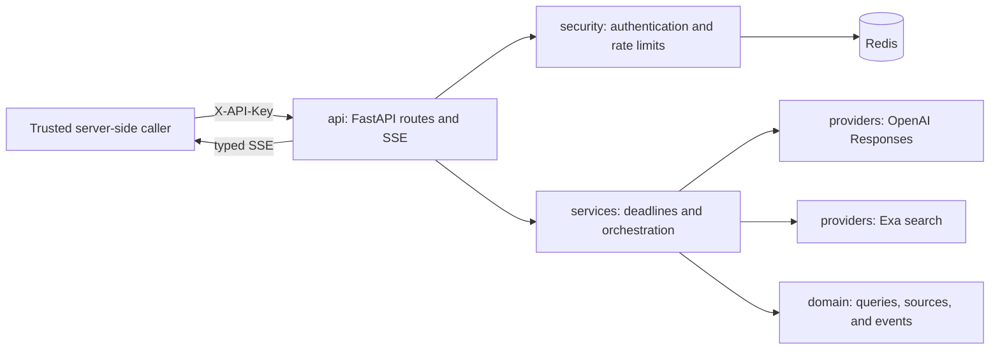

# SlipsharkAI

SlipsharkAI is a FastAPI backend for sports research. It decides whether a
question needs a web search, searches through Exa when needed, and streams
an OpenAI answer with structured source records.

This repository is not deployed at a verified public URL. The demo below uses
injected fixtures, so it does not contact OpenAI, Exa, Redis, or the network.

## Overview

The API is designed for a trusted server-side caller. Each research request is
authenticated with `X-API-Key`, limited by API-key principal, and returned as a
typed server-sent event stream. Provider errors are logged on the server and
reduced to one safe public error event.

The production path uses Redis for shared rate limits. If Redis cannot answer,
research requests fail closed instead of bypassing the limit.

## Demo



[Watch the 20-second local demo](docs/demo/local-sse-stream.mp4)

The screenshot and recording come from `uv run python scripts/demo.py`. They
show a local simulation with deterministic providers, not a paid-provider or
deployed response.

```text
LOCAL SIMULATION: deterministic fixtures; no network or provider calls

event: delta
data: {"request_id":"7c70ef12-4d60-4e6f-a2ee-26c77104c52e","type":"delta","text":"Late-game offense improves..."}

event: sources
data: {"request_id":"7c70ef12-4d60-4e6f-a2ee-26c77104c52e","type":"sources","sources":[{"id":"local-spacing-note","title":"Spacing and late-game possessions","url":"https://example.com/basketball/spacing","published_at":"2024-06-01T00:00:00Z","snippet":"Local fixture."}]}

event: done
data: {"request_id":"7c70ef12-4d60-4e6f-a2ee-26c77104c52e","type":"done"}
```

## API contract

| Method | Path | Authentication | Result |
| --- | --- | --- | --- |
| `GET` | `/health/live` | None | Process liveness |
| `GET` | `/health/ready` | None | Configuration and Redis readiness |
| `POST` | `/research` | `X-API-Key` | `text/event-stream` |

A research body accepts one question, a client platform, and `max_results`, a
requested search-result limit from one to ten. Unknown fields are rejected.

```bash
curl -N http://127.0.0.1:8000/research \
  -H 'Content-Type: application/json' \
  -H 'X-API-Key: replace-with-local-key' \
  --data '{"query":"How can a basketball team improve its late-game offense?","platform":"web","max_results":5}'
```

The stream emits `delta`, `sources`, and `done` events. A failure after the
stream starts emits `error` with one of `provider_timeout`,
`provider_unavailable`, or `internal_error`. Provider messages and stack traces
do not cross the API boundary.

Before streaming begins, the route can return:

- `401` for a missing or invalid API key;
- `422` for invalid input or configured-limit violations;
- `429` with `Retry-After` when the principal exceeds its fixed window;
- `503` when the production rate limiter is unavailable.

## Architecture


```mermaid
flowchart LR
    caller["Trusted server-side caller"] -->|"X-API-Key"| api["api: FastAPI routes and SSE"]
    api --> security["security: authentication and rate limits"]
    security --> redis[(Redis)]
    api --> service["services: deadlines and orchestration"]
    service --> openai["providers: OpenAI Responses"]
    service --> exa["providers: Exa search"]
    service --> domain["domain: queries, sources, and events"]
    api -->|"typed SSE"| caller
```

Package responsibilities stay narrow:

- `api` owns HTTP validation, dependencies, lifespan, health, and SSE framing.
- `security` owns constant-time API-key checks and local or Redis rate limits.
- `services` owns the request deadline, provider sequence, source bounds, and
  answer bounds.
- `providers` adapts OpenAI Responses and Exa into typed internal protocols.
- `domain` defines immutable queries, sources, and stream events.

## Request lifecycle

1. FastAPI validates the request body and authenticates `X-API-Key`.
2. The rate limiter consumes one request for that key's principal.
3. OpenAI returns one typed decision: search with one query, or skip search.
4. Exa results are validated, deduplicated by URL, and bounded before use.
5. OpenAI streams plain-text answer deltas. Source text is treated as
   untrusted data, not instructions.
6. The API emits public sources and a final `done` event. Cancellation closes
   the provider stream.

Planner, search, answer, and whole-request deadlines are enforced separately.
The default whole-request limit is 45 seconds, and the default answer limit is
12,000 characters.

## Local setup

Install Python 3.12.13 and uv 0.8.18. Install the Python patch version before
running uv on a fresh machine because this pinned uv release cannot download it
from its frozen interpreter catalogue.

The offline verifier is the shortest working setup:

```bash
uv sync --frozen --all-groups
./scripts/verify
```

The application checks need no secrets, Redis process, provider account, or
open port. A first `uv sync` may download packages from the configured registry;
the smoke and demo make no network requests.

Starting the provider-backed API requires Redis plus real OpenAI and Exa keys.
Generate a server-to-server key locally with `uv run python generate_key.py`,
then export the full prefixed configuration:

```bash
export SLIPSHARK_ENVIRONMENT=local
export SLIPSHARK_HOST=127.0.0.1
export SLIPSHARK_PORT=8000
export SLIPSHARK_OPENAI_API_KEY=replace-with-openai-key
export SLIPSHARK_EXA_API_KEY=replace-with-exa-key
export SLIPSHARK_API_KEYS='{"local-cli":"replace-with-a-local-key-at-least-32-chars"}'
export SLIPSHARK_REDIS_URL=redis://127.0.0.1:6379/0
uv run python -m slipshark
```

`.env.example` is a reference file. Application settings do not load `.env`
automatically, which avoids silently reading a local secret file in production.

## Verification

`./scripts/verify` is the canonical fast gate. It checks the lockfile, performs
a frozen sync, runs Ruff and strict mypy, runs the complete test suite, then
runs the offline API smoke and local demo. The current branch passes this gate
with 150 tests.

`./scripts/verify --full` adds the image build, non-root inspection, isolated
Redis readiness transition, loopback-only port check, runtime filesystem
checks, and cleanup assertions. That Docker gate is implemented but has not run
successfully on this branch yet.

## Container run

The Dockerfile is pinned to Python 3.12.13 and uv 0.8.18, installs production
dependencies only, and declares the unprivileged `slipshark` user. Treat the
image as a checkpoint until this command passes on an attended Docker host:

```bash
./scripts/verify --full
```

The verifier builds `slipshark:verify` and owns its temporary internal network,
Redis container, app container, and loopback binding. It does not call OpenAI
or Exa.

## Deployment boundary

`railway.json` configures Railway to build the Dockerfile and use
`/health/ready` for deployment health. No Railway service, public domain, DNS
record, production secret, or live endpoint has been verified for this branch.
See [DEPLOYMENT.md](DEPLOYMENT.md) for the gated deployment and rollback path.

Keep provider credentials, Redis URLs, and `SLIPSHARK_API_KEYS` on a trusted
server. A browser or distributed mobile app must call through a protected proxy
instead of receiving these values.

## Limitations

- The public demo uses fixtures. It does not prove live OpenAI or Exa behavior.
- No deployment, TLS endpoint, or custom domain has been verified.
- Rate limits are per configured API-key principal, not per end user.
- The service has no account system, saved research history, or response cache.
- The Exa adapter does not request a freshness window. Search recency depends on
  the query and provider response.
- Sources are returned as one list, not mapped sentence by sentence. The model
  can still produce an incorrect answer.
