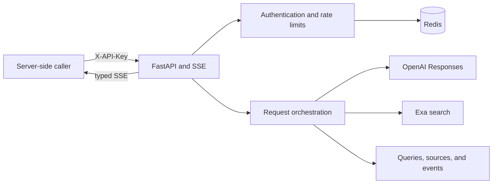

# SlipsharkAI

SlipsharkAI is the backend from a sports research app I built. It uses FastAPI,
OpenAI, Exa, and Redis. A request comes in as a question; the service decides
whether it needs a web search, gathers sources when it does, and streams the
answer and source links over server-sent events.

The app used these OpenAI and Exa integrations with live provider keys. The
public screenshot uses local fixtures so anyone can run the same request flow
without those keys.

## Demo


This is output from `uv run python scripts/demo.py`. The demo swaps in fixed
provider responses but runs through the same request and streaming code.

```text
event: delta
data: {"request_id":"7c70ef12-4d60-4e6f-a2ee-26c77104c52e","type":"delta","text":"Late-game offense improves..."}

event: sources
data: {"request_id":"7c70ef12-4d60-4e6f-a2ee-26c77104c52e","type":"sources","sources":[{"id":"local-spacing-note","title":"Spacing and late-game possessions","url":"https://example.com/basketball/spacing","published_at":"2024-06-01T00:00:00Z","snippet":"Local fixture."}]}

event: done
data: {"request_id":"7c70ef12-4d60-4e6f-a2ee-26c77104c52e","type":"done"}
```

## API

| Method | Path | Authentication | Result |
| --- | --- | --- | --- |
| `GET` | `/health/live` | None | Process liveness |
| `GET` | `/health/ready` | None | Configuration and Redis readiness |
| `POST` | `/research` | `X-API-Key` | `text/event-stream` |

`POST /research` accepts a question, a client platform, and a `max_results`
value from one to ten.

```bash
curl -N http://127.0.0.1:8000/research \
  -H 'Content-Type: application/json' \
  -H 'X-API-Key: replace-with-local-key' \
  --data '{"query":"How can a basketball team improve its late-game offense?","platform":"web","max_results":5}'
```

The stream sends `delta`, `sources`, and `done` events. Errors use a small
public set of codes instead of exposing provider messages or stack traces.
Requests are authenticated before streaming and rate-limited by API key.

## Architecture


```mermaid
flowchart LR
    caller["Server-side caller"] -->|"X-API-Key"| api["FastAPI and SSE"]
    api --> security["Authentication and rate limits"]
    security --> redis[(Redis)]
    api --> service["Request orchestration"]
    service --> openai["OpenAI Responses"]
    service --> exa["Exa search"]
    service --> domain["Queries, sources, and events"]
    api -->|"typed SSE"| caller
```

- `api` handles HTTP validation, dependencies, health checks, and SSE framing.
- `security` handles API-key checks and local or Redis-backed rate limits.
- `services` controls provider order, deadlines, and response bounds.
- `providers` contains the OpenAI and Exa adapters.
- `domain` defines the query, source, and stream event types.

## Request flow

1. FastAPI validates the body, checks the API key, and consumes a rate-limit
   slot.
2. OpenAI decides whether the question needs a search.
3. If it does, Exa results are validated, deduplicated by URL, and capped
   before they reach the answer prompt.
4. OpenAI streams the answer as plain-text deltas.
5. The API sends the sources and a final `done` event. Cancelling the request
   closes the provider stream.

Planner, search, answer, and whole-request timeouts are separate. The default
whole-request timeout is 45 seconds and answers are capped at 12,000
characters.

## Run locally

Install the versions in `.tool-versions`: Python 3.12.13 and uv 0.8.18.
Python needs to be installed before the first `uv sync`.

```bash
uv sync --frozen --all-groups
./scripts/verify
```

The verifier, smoke test, and screenshot demo do not need secrets or a running
Redis process.

To run the provider-backed API, start Redis and set OpenAI, Exa, and service API
keys:

```bash
export SLIPSHARK_ENVIRONMENT=local
export SLIPSHARK_HOST=127.0.0.1
export SLIPSHARK_PORT=8000
export SLIPSHARK_OPENAI_API_KEY=replace-with-openai-key
export SLIPSHARK_EXA_API_KEY=replace-with-exa-key
export SLIPSHARK_API_KEYS='{"local-cli":"replace-with-a-local-key-at-least-32-chars"}'
export SLIPSHARK_REDIS_URL=redis://127.0.0.1:6379/0
uv run python -m slipshark
```

`.env.example` lists the settings. The app does not load `.env`
automatically.

## Verification

`./scripts/verify` runs a frozen dependency sync, Ruff, strict mypy, 150
tests, the API smoke test, and the local SSE demo.

`./scripts/verify --full` also builds the Docker image, starts temporary
Redis and app containers, checks the non-root runtime and readiness transition,
then removes its containers and networks. The full gate passed from a clean
clone, and CI passes on the current main branch.

## Deployment

`railway.json` configures a Dockerfile build and uses `/health/ready` for
deployment health. [DEPLOYMENT.md](DEPLOYMENT.md) has the setup and rollback
steps.

OpenAI keys, Exa keys, Redis URLs, and `SLIPSHARK_API_KEYS` belong on the
server. A browser or mobile app should call this service through its own
backend rather than contain those values.
